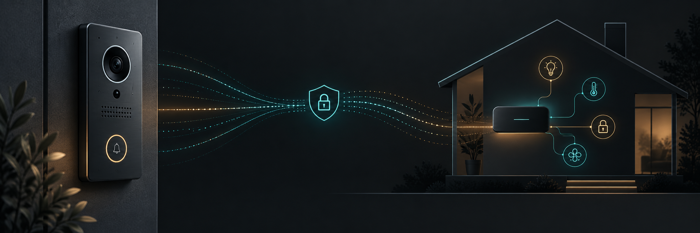

# BTicino HOMETOUCH HomeKit bridge

[](https://github.com/bubez81/bticino-hometouch-homekit/actions/workflows/tests.yml)
[](https://www.python.org/)
[](LICENSE)
[](#what-works-today)
[](https://github.com/sponsors/bubez81)
[](https://buymeacoffee.com/bubez81)

Experimental, firmware-free integration of a BTicino HOMETOUCH video door
entry system with HomeKit through Homebridge.

The current prototype registers as an additional SIP endpoint, receives
incoming calls using SIP early media, negotiates H.264 over SRTP/SDES, requests
a keyframe with authenticated SRTCP feedback, produces a private snapshot and
forwards live video to Homebridge on the local loopback interface.

> **Project status: experimental.** Incoming video works on the tested system.
> On-demand activation, two-way audio, reliable entrance identification and
> opening controls are still under development.

## Support the project

If this project is useful to you, you can support its continued development,
testing and documentation through
[GitHub Sponsors](https://github.com/sponsors/bubez81) or
[Buy Me a Coffee](https://buymeacoffee.com/bubez81). Contributions are
optional and do not include rewards or support services.

## What works today

| Capability | Status |
| --- | --- |
| Read-only account, plant, gateway and SIP endpoint discovery | Verified |
| SIP registration and renewal on one TLS connection | Verified on one HOMETOUCH installation |
| `100 Trying` / `183 Session Progress` without answering | Verified on one HOMETOUCH installation |
| H.264 SRTP/SDES snapshot and short live early media | Verified on one HOMETOUCH installation |
| HomeKit doorbell notification through Homebridge | Verified on one HOMETOUCH installation |
| Creation of a fresh SIP endpoint and certificate | Implemented and simulated; live verification still required |
| On-demand video after the incoming call ends | Not implemented |
| Two-way audio, opening controls and reliable multi-entrance identity | Not implemented |

This is suitable for technically experienced testers, not yet a turnkey
consumer installation. A spare HOMETOUCH SIP endpoint slot is required.

## Design principles

- No HOMETOUCH firmware modification.
- No interception or modification of the existing gateway service.
- No `200 OK` during the current early-media flow, so the bridge does not
  answer the call.
- Media exposed to Homebridge only through `127.0.0.1`.
- Runtime captures and key material stored outside the repository with
  restrictive permissions.

## Requirements

- A BTicino HOMETOUCH system offering SIP/TLS and H.264 SRTP using
  `AES_CM_128_HMAC_SHA1_80` with SDES
- A host supported by Python 3.9+, FFmpeg, OpenSSL and Homebridge. The listener
  itself has no macOS-specific runtime dependency and is expected to work on
  Linux and other Unix-like systems as well
- Homebridge with `@homebridge-plugins/homebridge-camera-ffmpeg`
- Network policy permitting the configured RTP/RTCP UDP port range from the
  HOMETOUCH device to the bridge host
- Legally obtained credentials and certificates for your own installation

## Guided onboarding

The intended installation path is a dedicated Door Entry user for the bridge,
invited to the home/plant by its owner. Use a real dedicated email address or
email alias; `homeassistant` is a useful display name, but is not necessarily a
valid account identifier by itself.

The `bticino-onboard` command authenticates that dedicated user, lets the
installer select a plant and gateway, creates a separate SIP endpoint,
generates its private key locally, requests the matching client certificate and
writes the runtime configuration with restrictive permissions. It must not
copy credentials, certificates or application storage from a family member's
phone.

Its read-only discovery mode has been verified against a dedicated invited
account. SIP endpoint and certificate creation are implemented but remain
experimental until the complete mutating flow has been verified on an
installation with a free endpoint slot. See
[`docs/onboarding.md`](docs/onboarding.md).

Run the non-mutating check first:

```sh
./scripts/bticino-onboard --email dedicated-account@example.com
```

The password is requested without echo and is not saved. The command stops
after listing/selecting the plant and checking existing SIP endpoints. Do not
use `--apply` on a personal account.

After checking the selected installation, provision the dedicated bridge:

```sh
./scripts/bticino-onboard --email dedicated-account@example.com --apply
```

This generates `config.json`, SIP credentials, a locally generated private key
and its certificates in `~/.config/bticino-hometouch/` (or
`$XDG_CONFIG_HOME/bticino-hometouch/`). Files containing secrets are mode 600;
the directory is mode 700. The known cloud limit is 20 provisioned SIP
endpoints: the command refuses to create another one when the installation is
full.

## Quick start for testers

1. Invite a new, dedicated Door Entry account to the installation and accept
   the invitation. Do not use the owner's personal account for the bridge.
2. Install Python 3.9 or newer, FFmpeg and OpenSSL. Install Homebridge and
   `@homebridge-plugins/homebridge-camera-ffmpeg` if HomeKit is wanted.
3. Clone this repository and run the read-only discovery command shown above.
4. Confirm the selected plant and verify that fewer than 20 provisioned SIP
   endpoints are reported.
5. Run the `--apply` command shown above. This is the experimental cloud-writing
   step; do not repeat it blindly if certificate enrollment fails.
6. If the HOMETOUCH and bridge are separated by a firewall or VLAN, allow
   outbound TCP 5061 from the bridge for SIP/TLS and inbound UDP 2202–2213 from
   the HOMETOUCH to the bridge. Do not expose those UDP ports to the internet.
7. Start the listener using the cross-platform command below or the macOS
   helper. Ring once and check `listener.log` for successful registration,
   `100 Trying`, `183 Session Progress` and `SNAPSHOT OK`.
8. Configure Homebridge only after the listener works. Its helper is read-only
   unless `--apply` is supplied and backs up the configuration before writing.

## Configuration

For guided installations, use the `config.json` produced above. For manual
installations, copy `config.example.json`, replace every example value, and
protect it with mode `600`. Credentials and private keys must remain external
files and must never be committed.

Raw SIP capture is disabled by default because SDP contains live SRTP key
material. Do not enable it on an unattended public-facing installation.

The runtime directory and executable paths are configurable. The example uses
`/opt/bticino-sniffer`; adapt `base_dir`, `ffmpeg` and `openssl` to the host.
Read `SECURITY.md` before collecting or sharing diagnostic data.

### Cross-platform listener

The listener is ordinary Python and can be started directly on a compatible
host:

```sh
BTICINO_SNIFFER_CONFIG=/path/to/config.json \
  python3 src/bticino_hometouch_listener.py
```

Use the service manager native to the host to keep it running. A systemd unit
and Linux installer are planned; contributions and installation reports are
welcome.

### macOS helper

Before making changes, verify the required programs and inspect the generated
Homebridge change:

```sh
python3 --version
ffmpeg -version
openssl version
python3 ./scripts/configure_homebridge.py
```

Install `@homebridge-plugins/homebridge-camera-ffmpeg` through the Homebridge
UI, as recommended by its maintainers. Then install the listener and apply the
Homebridge configuration:

```sh
sudo env BTICINO_CONFIG="$HOME/.config/bticino-hometouch/config.json" \
  ./scripts/install.sh
python3 ./scripts/configure_homebridge.py --apply
sudo launchctl kickstart -k system/com.homebridge.server
```

On first installation, `BTICINO_CONFIG` is mandatory. On later updates it may
be omitted: the installer preserves the private configuration already stored
at `/opt/bticino-sniffer/config.json`. Before accepting an installation it now
validates the JSON and referenced private files, confirms that FFmpeg and
OpenSSL are executable, starts the service and waits for a successful SIP
registration. If any check fails, the previous listener, configuration and
LaunchDaemon are restored automatically.

To update an existing installation from a fresh repository checkout:

```sh
sudo ./scripts/install.sh
```

Success is reported as `HEALTHCHECK_OK=TLS/SIP registration`. The installer
does not print credentials, certificate contents, SIP account identifiers or
the private configuration.

### Migrating an older macOS service

Installations made during early development may still run under a private or
legacy LaunchDaemon label. Do not start the public service alongside it: two
listeners must not share the same SIP endpoint and media ports. The migration
helper stops the legacy service, invokes the verified installer and archives
the old plist only after the new service has registered successfully:

```sh
sudo ./scripts/migrate_macos_service.sh
```

The known early label is detected by default. For another explicitly verified
label, set `BTICINO_LEGACY_LABEL`. On failure the helper removes the incomplete
new service and reactivates the legacy one. The old plist is retained inside
the private `/opt/bticino-sniffer/backups/` directory rather than deleted.

The included installer is specifically a macOS `launchd` helper. It backs up
an existing listener and LaunchDaemon before replacing them. Set
`BTICINO_PYTHON` and `BTICINO_FFMPEG` when those programs are installed in
non-default locations. The chosen Python executable is retained through a
root-owned link used by the LaunchDaemon, so it does not depend on launchd's
restricted `PATH`.

## Current data flow

```text
HOMETOUCH -- SIP/TLS --> listener
HOMETOUCH -- H.264/SRTP --> listener/FFmpeg
listener -- MPEG-TS/UDP loopback --> Homebridge
listener -- JPEG/HTTP loopback --> Homebridge
Homebridge -- HomeKit Secure RTP --> Apple Home
```

## Roadmap

- Measure and harden immediate keyframe requests across installations
- Replace the prototype scripts with a packaged service and guided installer
- Verify dedicated-account provisioning end-to-end on additional installations
- Identify multiple entrance panels without relying on random RTP SSRC values
- Add on-demand video activation
- Add receive-only audio, followed by carefully tested two-way audio
- Associate the correct opening control with each entrance where HomeKit allows

## Disclaimer

This is an independent community project and is not affiliated with or
endorsed by BTicino, Legrand or Apple. Use it only on equipment and networks
you own or are authorized to administer.

## License

MIT
