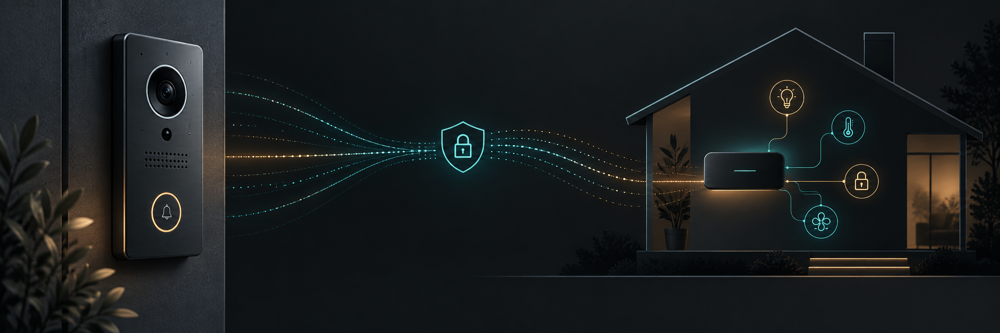

# BTicino HOMETOUCH HomeKit bridge

[](https://github.com/bubez81/bticino-hometouch-homekit/actions/workflows/tests.yml)
[](https://www.python.org/)
[](LICENSE)
[](#what-works-today)
[](https://github.com/sponsors/bubez81)
[](https://buymeacoffee.com/bubez81)

Experimental, firmware-free integration of a BTicino HOMETOUCH video door
entry system with HomeKit through Homebridge.

The current prototype registers as an additional SIP endpoint, receives
incoming calls using SIP early media, negotiates H.264 over SRTP/SDES, requests
a keyframe with authenticated SRTCP feedback, produces a private snapshot and
forwards live video to Homebridge on the local loopback interface.

> **Project status: experimental.** Incoming video works on the tested system.
> Local entrance classification and post-call snapshot fallback are available
> experimentally. A dedicated Homebridge plugin now includes on-demand video,
> incoming-call audio and contextual opening. Hardware validation is incomplete;
> see the [October update](docs/update-2026-10.md) before enabling these features.
> Since 2026-10-05 the dedicated plugin publishes the doorbell as a standalone
> HomeKit Video Doorbell; since 2026-10-06 live views and answered rings carry
> real two-way audio (Speex towards the gateway); see the
> [changelog](CHANGELOG.md#2026-10-06).

See the [changelog](CHANGELOG.md), [Home Assistant integration](docs/home-assistant.md), [plugin architecture](docs/plugin-architecture.md)
and [current validation status](homebridge-bticino-hometouch/LIVE-VALIDATION.md).

## Support the project

If this project is useful to you, you can support its continued development,
testing and documentation through
[GitHub Sponsors](https://github.com/sponsors/bubez81) or
[Buy Me a Coffee](https://buymeacoffee.com/bubez81). Contributions are
optional and do not include rewards or support services.

## What works today

| Capability | Status |
| --- | --- |
| Read-only account, plant, gateway and SIP endpoint discovery | Verified |
| SIP registration and renewal on one TLS connection | Verified on one HOMETOUCH installation |
| `100 Trying` / `183 Session Progress` without answering | Verified on one HOMETOUCH installation |
| H.264 SRTP/SDES snapshot and short live early media | Verified on one HOMETOUCH installation |
| HomeKit doorbell notification through Homebridge | Verified on one HOMETOUCH installation; the dedicated plugin requires `standalone: true` (Video Doorbell category) |
| Creation/recovery of a SIP endpoint and certificate | Verified on one installation; empty HTTP 201 responses require recovery |
| Continuous last-snapshot fallback after the incoming call ends | Implemented; broader HomeKit testing required |
| Privacy-preserving multi-entrance classification | Implemented experimentally; requires local calibration |
| On-demand video in the dedicated plugin | Experimental; source lifetime/reliability require further testing |
| Incoming two-way audio (answer a ring from Apple Home and talk) | Verified on one HOMETOUCH installation (Speex; needs an FFmpeg with `libspeex`) |
| Entrance-panel sound in on-demand live views | Verified in Apple Home and Home Assistant on one installation |
| Contextual opening and separate HomeKit lock | Implemented, opt-in; correct physical entrance requires verification |
| Opening configured entrances on demand (`open_entrance`) | Verified on one HOMETOUCH installation (opt-in) |
| Authenticated network API with event stream | Implemented, opt-in |
| Home Assistant integration (HACS) and ring-notification blueprint | Experimental; see [Home Assistant](docs/home-assistant.md) |

This is suitable for technically experienced testers, not yet a turnkey
consumer installation. A spare HOMETOUCH SIP endpoint slot is required.

## Choose your home platform

The listener does all SIP and media work; pick one or both front ends.

| | Homebridge → Apple Home | Home Assistant |
| --- | --- | --- |
| Guide | [docs/homebridge.md](docs/homebridge.md) | [docs/home-assistant.md](docs/home-assistant.md) |
| Connects through | local IPC socket (same host) | authenticated network API (any host on the LAN) |
| Ring notification | Apple Home, with snapshot (`standalone: true`) | Companion App via blueprint, with snapshot |
| Opening | MQTT bridge + mqttthing locks, offered next to the doorbell | one button per entrance; the blueprint offers the entrance that rang |
| Live video | yes (experimental) | yes, through go2rtc (experimental) |
| Two-way audio | yes: answering a ring and on-demand live view | live sound yes; talking experimental (go2rtc backchannel, WebRTC Camera card) |

Steps in short:

- **Homebridge:** enable IPC on the listener, run the plugin in a dedicated
  Homebridge instance with `standalone: true`, add *Videocitofono* in Apple Home,
  choose *Stream* and enable doorbell notifications. For gates, run the MQTT
  bridge and add mqttthing locks in the doorbell's room.
- **Home Assistant:** enable the listener's `api` section with a token, add
  this repository to HACS as an integration, configure *BTicino HOMETOUCH*,
  then import the ring-notification blueprint.

## Design principles

- No HOMETOUCH firmware modification.
- No interception or modification of the existing gateway service.
- Passive early-media viewing does not answer; the dedicated plugin's incoming
  live flow can explicitly accept a call, with outgoing microphone audio gated.
- Media exposed to Homebridge only through `127.0.0.1`.
- Runtime captures and key material stored outside the repository with
  restrictive permissions.

## Requirements

- A BTicino HOMETOUCH system offering SIP/TLS and H.264 SRTP using
  `AES_CM_128_HMAC_SHA1_80` with SDES
- A host supported by Python 3.9+, FFmpeg, OpenSSL and Homebridge. The listener
  itself has no macOS-specific runtime dependency and is expected to work on
  Linux and other Unix-like systems as well
- Homebridge with `@homebridge-plugins/homebridge-camera-ffmpeg`
- Network policy permitting the configured RTP/RTCP UDP port range from the
  HOMETOUCH device to the bridge host
- Legally obtained credentials and certificates for your own installation

## Guided onboarding

The intended installation path is a dedicated Door Entry user for the bridge,
invited to the home/plant by its owner. Use a real dedicated email address or
email alias; `homeassistant` is a useful display name, but is not necessarily a
valid account identifier by itself.

The `bticino-onboard` command authenticates that dedicated user, lets the
installer select a plant and gateway, creates a separate SIP endpoint,
generates its private key locally, requests the matching client certificate and
writes the runtime configuration with restrictive permissions. It must not
copy credentials, certificates or application storage from a family member's
phone.

Its read-only discovery mode has been verified against a dedicated invited
account. Creation followed by existing-endpoint recovery, certificate generation
and SIP registration has now been verified on one installation. See
[`docs/onboarding.md`](docs/onboarding.md).

Run the non-mutating check first:

```sh
./scripts/bticino-onboard --email dedicated-account@example.com
```

The password is requested without echo and is not saved. The command stops
after listing/selecting the plant and checking existing SIP endpoints. Do not
use `--apply` on a personal account.

### Invited account cannot see the plant

If the dedicated account can control the installation in the official Door
Entry app but onboarding reports `Nessun impianto visibile`, first update the
checkout and retry normal read-only discovery:

```sh
git pull
./scripts/bticino-onboard --email dedicated-account@example.com
```

The cloud has returned more than one response layout for invited users. The
onboarding parser accepts the known direct and nested layouts and can inspect
both the plants and invitations collections. If discovery still fails, run:

```sh
./scripts/bticino-onboard --email dedicated-account@example.com \
  --diagnose-discovery
```

Share only the line beginning with `Diagnosi discovery`. It reports container
types and record counts, never response keys, identifiers, account data,
tokens or cloud response values. Do not share the session line, password,
complete terminal history or screenshots containing personal information.
This diagnostic is read-only and does not require `--apply`.

After checking the selected installation, provision the dedicated bridge:

```sh
./scripts/bticino-onboard --email dedicated-account@example.com --apply
```

This generates `config.json`, SIP credentials, a locally generated private key
and its certificates in `~/.config/bticino-hometouch/` (or
`$XDG_CONFIG_HOME/bticino-hometouch/`). Files containing secrets are mode 600;
the directory is mode 700. The known cloud limit is 20 provisioned SIP
endpoints: the command refuses to create another one when the installation is
full.

## Quick start for testers

These steps describe the Camera-ffmpeg integration. The experimental dedicated
plugin has a separate [architecture and configuration guide](docs/plugin-architecture.md).

1. Invite a new, dedicated Door Entry account to the installation and accept
   the invitation. Do not use the owner's personal account for the bridge.
2. Install Python 3.9 or newer, FFmpeg and OpenSSL. Install Homebridge and
   `@homebridge-plugins/homebridge-camera-ffmpeg` if HomeKit is wanted.
3. Clone this repository and run the read-only discovery command shown above.
4. Confirm the selected plant and verify that fewer than 20 provisioned SIP
   endpoints are reported.
5. Run the `--apply` command shown above. This is the experimental cloud-writing
   step; do not repeat it blindly if certificate enrollment fails.
6. If the HOMETOUCH and bridge are separated by a firewall or VLAN, allow
   outbound TCP 5061 from the bridge for SIP/TLS and inbound UDP 2202–2213 from
   the HOMETOUCH to the bridge. Do not expose those UDP ports to the internet.
7. Start the listener using the cross-platform command below or the macOS
   helper. Ring once and check `listener.log` for successful registration,
   `100 Trying`, `183 Session Progress` and `SNAPSHOT OK`.
8. Configure Homebridge only after the listener works. Its helper is read-only
   unless `--apply` is supplied and backs up the configuration before writing.

## Configuration

For guided installations, use the `config.json` produced above. For manual
installations, copy `config.example.json`, replace every example value, and
protect it with mode `600`. Credentials and private keys must remain external
files and must never be committed.

Raw SIP capture is disabled by default because SDP contains live SRTP key
material. Do not enable it on an unattended public-facing installation.

Entrance fingerprints are keyed locally so raw SIP/SDP identifiers are not
written to logs. Optional visual entrance profiles are ordinary private camera
images: keep them outside the repository in an owner-only directory and never
attach them to an issue. Visual classification is installation-specific and
must be calibrated with several known samples for every entrance.

When `post_call_fallback_seconds` is negative, the loopback video endpoint
continues serving the most recent private snapshot after a call ends. This can
prevent an older HomeKit notification from becoming blank, but it is not live
video. The dedicated plugin has a separate experimental on-demand path; packet
reception alone does not establish that an image is fresh. See the
[on-demand notes](docs/on-demand-research.md).

### Opening entrances

The listener can open door locks with the same press/release pulse used by the
official app (`*8*19*<address>##`, then `*8*20*<address>##`), sent as SIP
MESSAGE on its own registered connection. It is disabled by default:

```json
"entrance_open_enabled": true,
"entrance_pulse_seconds": 1.0,
"entrances": {"stairs": "20", "external": "21"}
```

Names are lowercase identifiers; addresses are the installation's lock
addresses (1–4 digits). With IPC enabled, `{"command":"open_entrance",
"entrance":"stairs"}` opens one entrance and `{"command":"entrance_status"}`
reports the last SIP response for press and release. One pulse runs at a time.
A release that cannot be sent during a reconnect is retried for 15 seconds. A
`200` response confirms delivery to the gateway, not physical opening.

#### MQTT lock topics (optional)

`src/bticino_mqtt_bridge.py` exposes every configured entrance as an MQTT lock,
compatible with Homebridge mqttthing `lockMechanism` and Home Assistant MQTT locks:

| Topic | Meaning |
| --- | --- |
| `<prefix>/<entrance>/set` | `UNLOCK` opens through the listener; `LOCK` only resets the state |
| `<prefix>/<entrance>/state` | retained `UNLOCK` during the pulse, then `LOCK` (assumed, no sensor) |
| `<prefix>/status` | retained `online` / `offline` (last will) |

Retained commands are ignored, so a stale `UNLOCK` never reopens a door. The
bridge needs `paho-mqtt` (the listener does not) and a private JSON file:

```json
{"host": "192.0.2.20", "port": 1883, "username": "…", "password": "…",
 "client_id": "bticino-hometouch-mqtt", "prefix": "hometouch", "unlock_seconds": 3.0}
```

```sh
python3 -m venv /opt/bticino-sniffer/venv-mqtt
/opt/bticino-sniffer/venv-mqtt/bin/pip install paho-mqtt
```

`packaging/io.github.bubez81.bticino-hometouch-mqtt.plist` runs it as a macOS
service next to the listener (IPC must be enabled).

### Network API for home automation (optional)

`src/bticino_api.py` serves an authenticated REST API with a Server-Sent Events
stream, using only the Python standard library. It is the interface for the
upcoming Home Assistant integration and works for any client.

```json
"api": {"enabled": true, "bind": "0.0.0.0", "port": 8790,
        "token_file": "/opt/bticino-sniffer/private/api_token",
        "allowed_clients": ["192.0.2.30"]}
```

Create the token with
`python3 -c "import secrets; print(secrets.token_urlsafe(32))" > api_token && chmod 600 api_token`.
Every request needs `Authorization: Bearer <token>`. Keep `allowed_clients` to
the home automation host, and never expose the port beyond the LAN.

| Endpoint | Purpose |
| --- | --- |
| `GET /api/v1/info` | API version, configured entrances, capabilities |
| `GET /api/v1/state` | SIP registration, active call, last ring (with entrance when known), last opening |
| `GET /api/v1/events` | `text/event-stream`: `state`, `ring`, `entrance_detected`, `snapshot_ready`, `call_ended`, `entrance_open`, `sip_registered`, `sip_disconnected` |
| `GET /api/v1/snapshot.jpg?width=&height=` | latest image, scaled and letterboxed when a size is given |
| `POST /api/v1/entrances/<name>/open` | opening pulse (`404` unknown, `409` busy, `403` disabled) |

Events carry an anonymous per-call reference, never SIP identifiers, keys or
media addresses. A ring is published immediately; `entrance_detected` follows
when visual classification identifies the entrance.

The optional `--diagnose-activations` probe decrypts configuration archives in
memory using the format password used by the official client (not your account
password). It prints XML structure only, without saving the configuration or
printing its values. AES archives require the optional onboarding dependency:

```sh
python3 -m venv .venv
.venv/bin/python -m pip install -r requirements-onboarding.txt
.venv/bin/python src/bticino_onboard.py --diagnose-activations
```

This read-only probe does not activate a camera. Validation on a real cloud
configuration is still required; encrypted synthetic fixtures cover decoding
and incorrect-password handling.

The runtime directory and executable paths are configurable. The example uses
`/opt/bticino-sniffer`; adapt `base_dir`, `ffmpeg` and `openssl` to the host.
Read `SECURITY.md` before collecting or sharing diagnostic data.

### Cross-platform listener

The listener is ordinary Python and can be started directly on a compatible
host:

```sh
BTICINO_SNIFFER_CONFIG=/path/to/config.json \
  python3 src/bticino_hometouch_listener.py
```

Use the service manager native to the host to keep it running. A systemd unit
and Linux installer are planned; contributions and installation reports are
welcome.

### macOS helper

Before making changes, verify the required programs and inspect the generated
Homebridge change:

```sh
python3 --version
ffmpeg -version
openssl version
python3 ./scripts/configure_homebridge.py
```

Install `@homebridge-plugins/homebridge-camera-ffmpeg` through the Homebridge
UI, as recommended by its maintainers. Then install the listener and apply the
Homebridge configuration:

```sh
sudo env BTICINO_CONFIG="$HOME/.config/bticino-hometouch/config.json" \
  ./scripts/install.sh
python3 ./scripts/configure_homebridge.py --apply
sudo launchctl kickstart -k system/com.homebridge.server
```

On first installation, `BTICINO_CONFIG` is mandatory. On later updates it may
be omitted: the installer preserves the private configuration already stored
at `/opt/bticino-sniffer/config.json`. Before accepting an installation it now
validates the JSON and referenced private files, confirms that FFmpeg and
OpenSSL are executable, starts the service and waits for a successful SIP
registration. If any check fails, the previous listener, configuration and
LaunchDaemon are restored automatically.

To update an existing installation from a fresh repository checkout:

```sh
sudo ./scripts/install.sh
```

Success is reported as `HEALTHCHECK_OK=TLS/SIP registration`. The installer
does not print credentials, certificate contents, SIP account identifiers or
the private configuration.

### Migrating an older macOS service

Installations made during early development may still run under a private or
legacy LaunchDaemon label. Do not start the public service alongside it: two
listeners must not share the same SIP endpoint and media ports. The migration
helper stops the legacy service, invokes the verified installer and archives
the old plist only after the new service has registered successfully:

```sh
sudo BTICINO_LEGACY_LABEL=<your.old.label> ./scripts/migrate_macos_service.sh
```

Set `BTICINO_LEGACY_LABEL` to the exact label of the old service
(`sudo launchctl list | grep -i bticino` shows it); the helper refuses to run
without it. On failure the helper removes the incomplete
new service and reactivates the legacy one. The old plist is retained inside
the private `/opt/bticino-sniffer/backups/` directory rather than deleted.

The included installer is specifically a macOS `launchd` helper. It backs up
an existing listener and LaunchDaemon before replacing them. Set
`BTICINO_PYTHON` and `BTICINO_FFMPEG` when those programs are installed in
non-default locations. The chosen Python executable is retained through a
root-owned link used by the LaunchDaemon, so it does not depend on launchd's
restricted `PATH`.

## Current data flow

```text
HOMETOUCH -- SIP/TLS --> listener
HOMETOUCH -- H.264/SRTP --> listener/FFmpeg
listener -- MPEG-TS/UDP loopback --> Homebridge
listener -- JPEG/HTTP loopback --> Homebridge
listener -- continuous latest-snapshot video fallback --> Homebridge
Homebridge -- HomeKit Secure RTP --> Apple Home
```

## Roadmap

- Measure and harden immediate keyframe requests across installations
- Replace the prototype scripts with a packaged service and guided installer
- Verify dedicated-account provisioning end-to-end on additional installations
- Identify multiple entrance panels without relying on random RTP SSRC values
- Validate privacy-preserving local visual entrance classification across more
  installations before using it by default for entrance-specific HomeKit events
- Add on-demand video activation
- Validate the continuous latest-snapshot fallback across additional HomeKit clients
- Verify talking from the on-demand live view at the door
- Associate the correct opening control with each entrance where HomeKit allows
- Home Assistant: answer a ring and talk (go2rtc backchannel), verified at the door

## Disclaimer

This is an independent community project and is not affiliated with or
endorsed by BTicino, Legrand or Apple. Use it only on equipment and networks
you own or are authorized to administer.

## License

MIT
